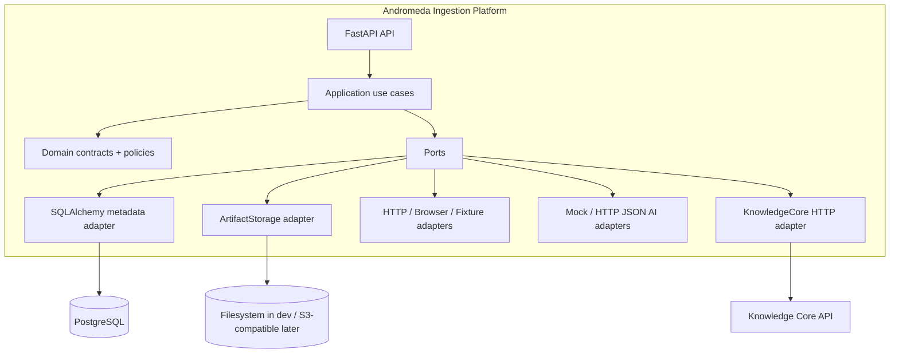

# Architecture

Andromeda Ingestion Platform is a modular monolith with Explicit Architecture.
The semantic boundary is the candidate/evidence contract; the persistence
boundary is the repository port; the external Core boundary is an HTTP
anti-corruption adapter.

Bounded responsibilities:

- Source Registry knows how to find and access a source, never its semantic truth.
- Fetch Layer returns bytes and transport metadata only.
- Preparation creates chunks and evidence locators.
- Extraction returns strict candidate contracts; AI output is untrusted.
- Validation applies schema, ontology snapshot, DSL, evidence and confidence rules.
- Publishing sends Observation envelopes to Core; it cannot accept Facts or
  activate Rules.

The old `andromeda` repository was used as donor evidence. Raw snapshot and
locator concepts were reused, fetch policy and source registry were adapted,
BMSTU/HSE access metadata was adapted, parser-per-page semantic code was dropped,
legacy ORM repositories were dropped, and Jev/provider calls were reimplemented
behind ports. See the complete matrix in the ultra plan and `docs/adr/`.

## Data ownership

Ingestion owns source definitions, discovery items, raw artifact metadata,
prepared representations, extraction results, candidate lifecycle, jobs, change
candidates and ingestion audit events. Core owns canonical objects, Facts,
Relations, Rules, Ontology, review decisions, dependencies and derived values.

The two services exchange versioned contracts, not SQLAlchemy models or tables.

