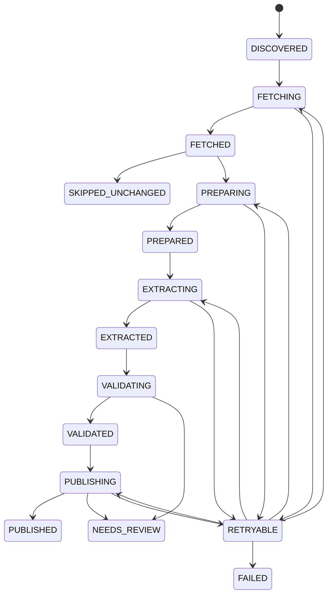

# Ingestion pipeline

Every transition is persisted with timestamp, correlation ID and audit event.
Pipeline and job updates use `row_version` optimistic locking. A repeated
source URL and checksum returns the existing RawArtifact and skips the AI path.

Raw bytes are immutable. A changed checksum creates a new artifact version,
marks the previous version non-current, and keeps `previous_artifact_id` so
change detection can compare extraction candidates.

Retries are bounded by `JOB_MAX_ATTEMPTS`; deterministic validation failures are
not retried indefinitely. Core outage leaves extraction/candidates persisted and
marks publication retryable.

