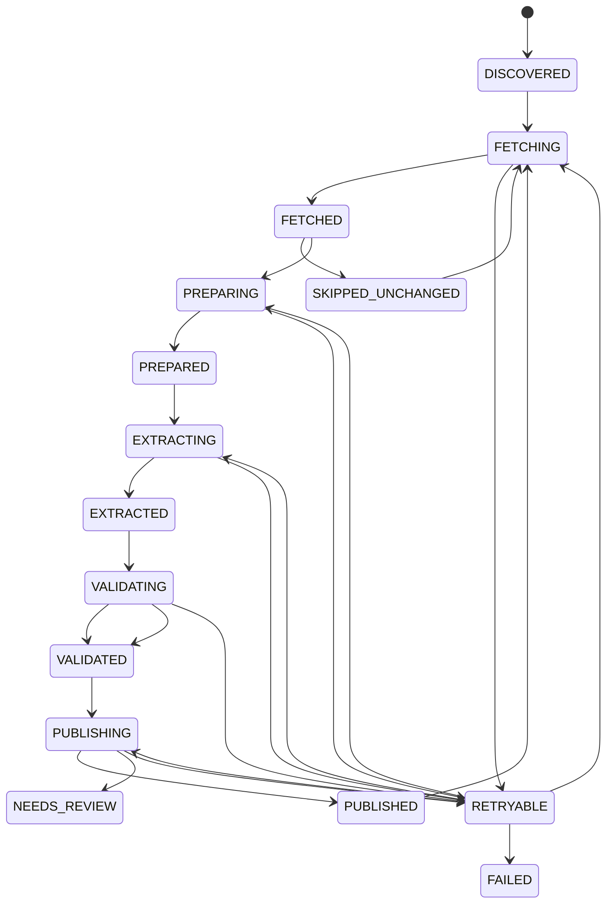

# Ingestion pipeline

Every transition is persisted with timestamp, correlation ID and audit event.
Pipeline and job updates use `row_version` optimistic locking. A repeated
`source + item + profile` key is a refresh stream, not a permanent cache key:
published and skipped runs fetch again, compare the checksum, and return
`SKIPPED_UNCHANGED` only after the source was actually checked.

Raw bytes are immutable. A changed checksum creates a new artifact version,
marks the previous version non-current, and keeps `previous_artifact_id` so
change detection can compare extraction candidates.

Retries are bounded by `JOB_MAX_ATTEMPTS`; deterministic validation failures are
not retried indefinitely. A retryable failure records the stage that failed and
the next invocation resumes at that stage: a Core outage leaves
extraction/candidates persisted and resumes at `PUBLISHING`, while a provider
failure resumes at `EXTRACTING` without fetching the document again.
